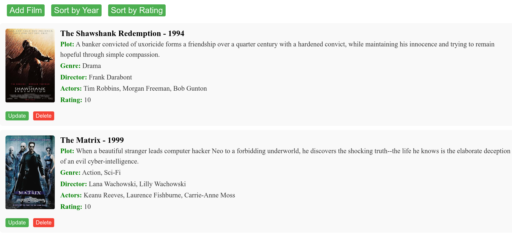

## myFilms - Marius-Augustin Niţu

Proiectul, myFilms, reprezintă o aplicație web pentru gestionare unei colecții de filme folosing Java Spring, o baza de date MySQL și un API public. Acesta dorește să implementeze funcționalitatea comună pe care IMDb, Letterboxd o oferă: posibilitatea de a crea și gestiona o lista proprie cu filmele dorite.

### OMDb API

OMDb API este un API-ul public folosit pentru a efectua cereri și obține JSON-uri reprezentative pentru filmele dorite. Aceste JSON-uri sunt prelucrate folosind Jackson pentru a construi obiectele Film. În urmă înregistrări am obținut o cheia pe care o folosesc să fac cereri sub următoarea formă:

```
https://www.omdbapi.com/?apikey=[key]&t=[title]&y=[year]
```

### Pagina Principala

În cadrul paginii principale se poate vizualiza colecția de filme precum și gestiona. Sunt prezente funcționalitatea de a adaugă un film, sau de a vizualiza colecția de filme sortată în funcție de an de lansare / rating. Fiecare film din colecție conține opțiunea de modificare și ștergere.

